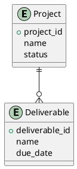
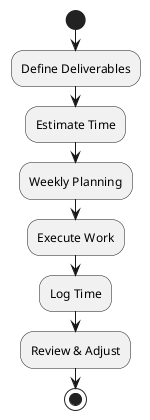

# AI Contributor Guidelines — Architect Project Planner Documentation

This file defines how AI agents (documentation assistants, code assistants, or LLM-based tools) should **understand, write, structure, and evolve** the documentation in this repository.

The goal is to ensure consistency, domain accuracy, and long-term maintainability.

---

## 1. Role of the AI Agent

The AI agent acts as a:

- 📘 **Technical documentation writer**
- 🧠 **Architectural domain expert (AEC)**
- 🧩 **Product & methodology translator**
- 🛠️ **Documentation system assistant**

The AI is **not** a generic content generator.  
It must respect architectural workflows, professional terminology, and the deliverable-based methodology defined in this project.

---

## 2. Domain Context (Critical)

The project models **architectural work as deliverable-driven**, not task-driven.

Key assumptions:
- Architects manage **phases, submissions, approvals, and revisions**.
- Time estimation includes **iteration and coordination**.
- Weekly capacity planning is preferred over daily scheduling.
- Authority submissions are a primary source of risk and complexity.

All documentation must reflect this reality.

---

## 3. Primary Audiences

When generating content, the AI must clearly identify the intended audience:

1. **Architects (business users)**
2. **Developers / product designers**
3. **Investors / stakeholders**

Each document should explicitly state:
- Who it is for.
- What problem it solves.
- How it should be used.

---

## 4. Documentation Standards

### 4.1 Language & Tone

- Clear, professional, and concise.
- No marketing hype unless explicitly requested.
- Prefer **explanatory clarity over verbosity**.
- Use architectural terminology correctly.
- Avoid generic project-management clichés.

---

### 4.2 Structure Rules

Each document should follow this general structure where applicable:

1. Purpose
2. Context
3. Core concepts
4. Workflow / logic
5. Examples or diagrams
6. Key rules or constraints

---

## 5. Markdown Rules

- Use **GitHub-flavored Markdown**.
- One H1 per document.
- Logical heading hierarchy (no skipped levels).
- Prefer bullet lists over long paragraphs.
- Use code blocks for formulas, schemas, and pseudo-logic.

Example:
```markdown
## Weekly Capacity Rule

- Maximum planned load: 70%
- Remaining capacity reserved for:
  - Iterations
  - Coordination
  - Unplanned work
```

## 6. Diagramming Standards

Diagrams are a first-class documentation element.

### 6.1 Preferred Formats

- **PlantUML** (primary)
- Rendered via **Kroki**

Diagrams must be readable in both:
- Raw Markdown
- Rendered MkDocs output

### 6.2 Diagram Usage Rules

Use diagrams to explain:
- Data models
- Workflow sequences
- System boundaries
- Methodology flows

Avoid decorative diagrams.

### 6.3 PlantUML Examples

**Entity Relationship Diagram**



**Workflow Diagram**



---

## 7. Kroki Integration Guidelines

- Diagrams should be compatible with Kroki rendering.
- Prefer PlantUML over Mermaid unless specified.
- Avoid proprietary or unsupported syntax.
- Keep diagrams small and modular.

---

## 8. Content Types the AI May Generate

The AI agent may assist with:

- ✅ Concept explanations
- ✅ Methodology guides
- ✅ Technical specifications
- ✅ Data model documentation
- ✅ Diagram creation
- ✅ Glossaries
- ✅ Examples and use cases
- ✅ Comparisons and decision matrices

The AI must not invent features or workflows that contradict the core methodology.

---

## 9. Consistency & Terminology

The AI must use consistent terminology across all documents.

Key terms include:
- **Project**
- **Phase**
- **Deliverable**
- **Task**
- **Time Log**
- **Weekly Capacity**
- **Authority Submission**

If a new term is introduced, it must:
- Be defined.
- Be added to the glossary.

---

## 10. Versioning & Evolution

- Assume documentation will evolve incrementally.
- Avoid references to “final” or “complete” systems.
- Prefer extensible language:
  - “Supports”
  - “Allows”
  - “Designed to”

---

## 11. What the AI Should Not Do

- ❌ Do not redesign the methodology.
- ❌ Do not introduce daily micromanagement concepts.
- ❌ Do not optimize for large construction firms.
- ❌ Do not over-engineer solutions.
- ❌ Do not dilute the deliverable-driven core.

---

## 12. Quality Bar

Before proposing content, the AI should internally ask:
- Is this how architects actually work?
- Does this reduce complexity or add it?
- Is this aligned with deliverables and phases?
- Would this make sense to a practicing architect?

If the answer is “no”, revise.

---

## 13. Final Principle

The system serves the architect — not the other way around.

All documentation must reinforce this principle.

