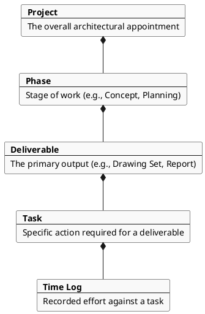

# Core Concepts

This section defines the **fundamental building blocks** of the Architect Project Planner.

These concepts form a **shared language** between:

- architects using the system,
- developers implementing it,
- and stakeholders evaluating it.

They are intentionally **simple, stable, and non-technical**.

---

## 1. Purpose of Core Concepts

Before discussing workflows, estimation, or software implementation, it is necessary to clearly define **what exists in the system**.

Core Concepts answer the question:

!!! abstract "The Core Question"
    *What are the things an architect actually manages?*

They provide:

- **Conceptual clarity** across all project stages
- **Consistent terminology** for all stakeholders
- **A foundation** for the methodology and technical specifications

---

## 2. Conceptual Hierarchy

Architectural work is organized around a clear hierarchy of responsibility. Each level contains the next, ensuring that all effort is tied back to a specific professional deliverable.

